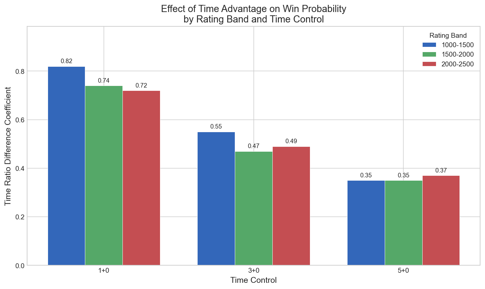
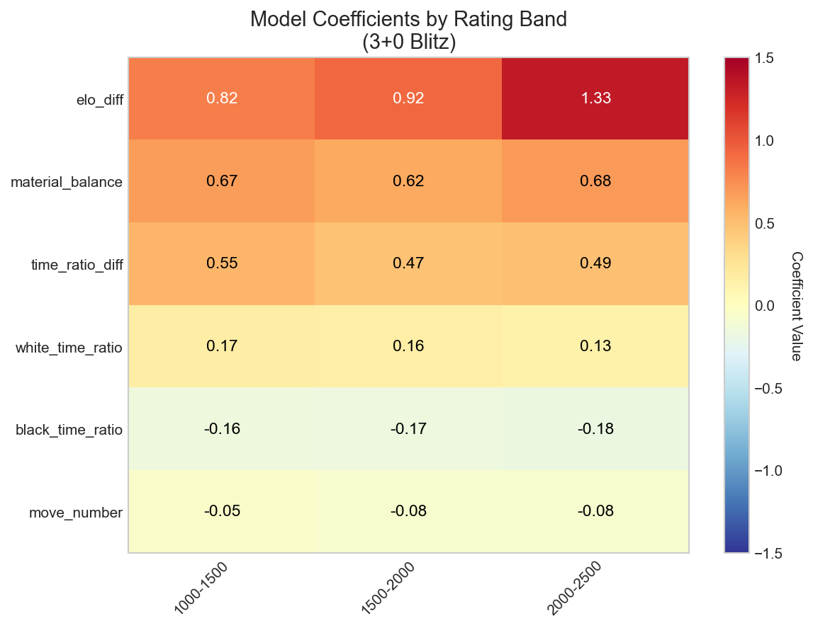
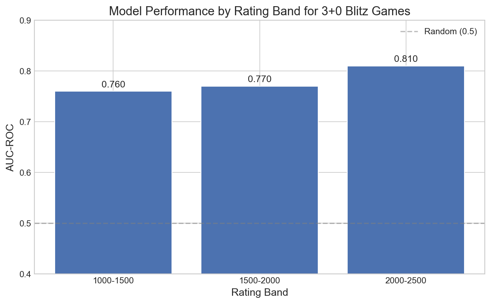
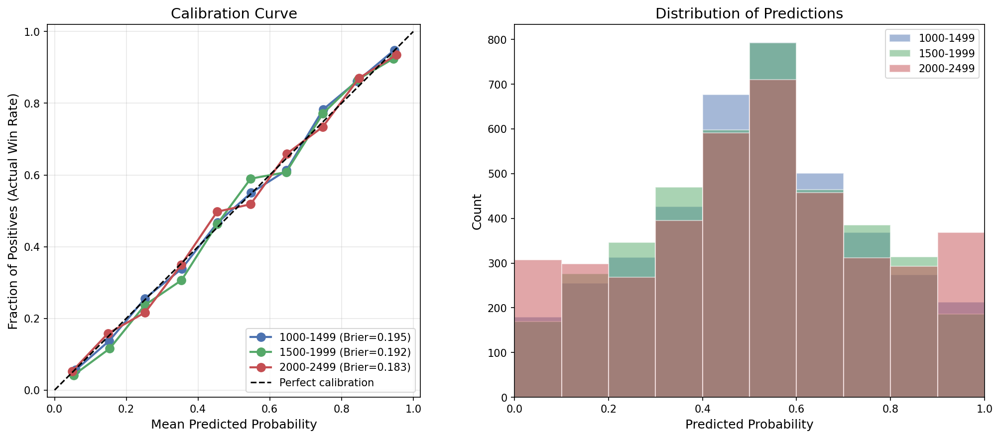
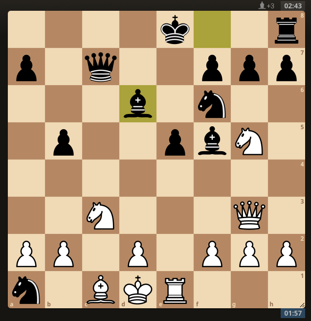
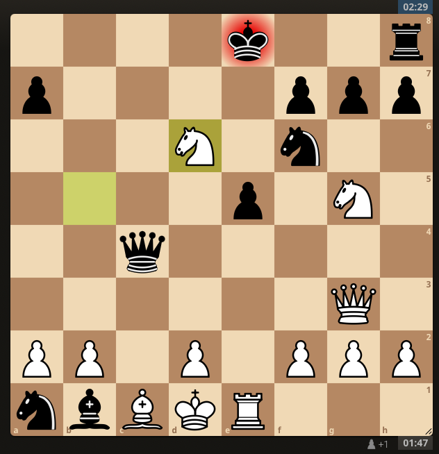

# Chess Win Probability Calculator

Uses logistic regression to predict bullet and blitz chess game outcomes from player ratings, material count, and time remaining. Trained on games played on [lichess.org](https://lichess.org).

## Key Findings

- **Elo difference is the strongest predictor** across all rating bands and time controls.
- **Time ratio difference is the second strongest predictor for all rating bands in bullet** - it is third across all rating bands in blitz (both 3+0 and 5+0).
- **Time pressure appears to affect all players equally** especially in 5+0 blitz chess - coefficients are similar from 1000-2500 Elo. 
- **Material advantage seems to matter less at higher ratings**: coefficient decreases from 0.79 → 0.68 → 0.61 as rating increases.


## Visualizations

### Time Coefficient Comparison

The effect of time pressure decreases as the total starting time of the game increases. Across rating bands, the effect of time pressure appears to be similar.



### Coefficient Heatmap

In blitz chess, time pressure matters, but not as much as rating or material advantages. See `results/` folder in repo for model coefficients for other time controls. 



### Model Performance

A simple logistic linear regression model predicts win probability fairly well. Model was trained on 20,000 games for each rating band and each time control. See `results\` folder in repo for modl performance of other time controls.



### Calibration Analysis

The model is well-calibrated across time controls and rating bands, with all Brier scores less than 0.2. The predictions for the 1000-1499 and 1500-1999 rating bands appear to be roughly normal, while the predictions for the 2000-2499 rating band have more predictions in the 0 to 0.1 and 0.9 to 1 range. This may be because stronger players are better at converting winning positions.

See `images/calibration_analysis` and `results/calibration_analysis` for full results of calibration analysis.



### Error Analysis

Manual inspection of games where the model was confident but wrong generally shows that the confidence was warranted and the favored player squandered their advantage. For example, in [one of the games analyzed](https://lichess.org/nhAPBbFq#30), black is up a bishop, up on time, and rated 440 points higher than their opponent, so the model predicts a 3.8% chance of white winning.



However, just a few moves later, black misses the [fork](https://en.wikipedia.org/wiki/Fork_(chess)) that blunders the black queen -- black resigned.



See `images/error_analysis` for full results of error analysis.

## Quick Start

```bash
# Clone and setup
git clone https://github.com/jake-p-bennett/chess-win-probability.git
cd chess-win-probability
pip install -r requirements.txt

# Predict win probability for a position
python scripts/predict.py \
    --model models/1000-1499/blitz_3.pkl \
    --fen "rn2kb1r/p3qppp/2p2n2/1N2p1B1/2B1P3/1Q6/PPP2PPP/R3K2R b KQkq - 0 10" \
    --white_elo 1200 --black_elo 1250 \
    --white_time "1:45" --black_time "1:12" \
    --time_control "3+0" \
    --verbose
```

## Project Structure

```
chess-win-probability/
├── README.md
├── requirements.txt
├── scripts/
│   ├── download_games.py              # Fetch games from Lichess API
│   ├── extract_features.py            # Extract features from PGN files
│   ├── train_model.py                 # Train and evaluate models
│   ├── compare_models.py              # Compare models across datasets
│   ├── predict.py                     # Make predictions on new positions
│   ├── calibration_analysis.py        # Make predictions on new positions
│   └── error_analysis.py.py           # Make predictions on new positions
├── models/                            # Saved model files (.pkl)
├── results/                           # Output tables and reports
├── notebooks/           
│   └── results_visualization.ipynb    # Visualize results
└── images/                            # Saved images of visualized results
```

## Full Pipeline

### 1. Download Games

```bash
# Download games from players in a rating range
python scripts/download_games.py \
    --rating_range 1500 1999 \
    --num_games 50000 \
    --output games/games_1500_1999.pgn
    --perf_type "blitz"

# Or from specific users
python scripts/download_games.py \
    --users DrNykterstein EricRosen \
    --max_per_user 1000 \
    --output games/top_level_games.pgn
```

### 2. Extract Features

```bash
# Extract features from all games
python scripts/extract_features.py \
    games/1000-1499/bullet_games.pgn \
    features/1000-1499/features_1_0.csv \
    --num_games 20000

# Filter by specific time control
python scripts/extract_features.py \
    games/1000-1499/blitz_games.pgn \
    features/1000-1499/features_3_0.csv \
    --num_games 20000 \
    --time_control "180+0"
```

### 3. Train Models

```bash
# Train and evaluate all model variants
python scripts/train_model.py \
    features/1000-1499/features_1_0.csv \
    --output_report results/1000-1499/bullet.txt \
    --save_model models/1000-1499/bullet.pkl
```

### 4. Compare Across Datasets

```bash
# Generate comparison table across different rating bands or time controls
python scripts/compare_models.py \
    features/1000-1499/bullet.csv \
    features/1500-1999/bullet.csv \
    features/2000-2499/bullet.csv \
    --labels "1000-1499" "1500-1999" "2000-2499" \
    --output_csv results/bullet_comparison_by_rating.csv
```
### 5. Analyze Model via Calibration Analysis and Error Analysis

```bash
# Analyze how well-calibrated a model's probability predictions are
python calibration_analysis.py \
    --model models/1000-1499/blitz_3.pkl models/1500-1999/blitz_3.pkl models/2000-2499/blitz_3.pkl \
    --data features/1000-1499/features_3_0.csv features/1500-1999/features_3_0.csv features/2000-2499/features_3_0.csv \
    --labels "1000-1499" "1500-1999" "2000-2499" \
    --output images/calibration_comparison.png \
    --output_file calibration_results.txt

# Finds games where the model was confident but wrong
# Provides URLs to manually examine games on lichess.org
python error_analysis.py \
    --model models/1500-1999/blitz_3.pkl \
    --data features/1500-1999/features_3_0.csv \
    --output results/errors_1500_1999_blitz3.csv \
    --threshold 0.80 \
    --top 20
```

## Data

Games are downloaded from the [Lichess API](https://lichess.org/api). Raw PGN files are not included in this repo due to size — use `download_games.py` to fetch them.

Bullet chess games start with 1 minute per side. Blitz chess games start with either 3 minutes or 5 minutes (denoted by `blitz_3.txt` and `blitz_5.txt` in the results folder, respectively). 

**Data processing notes:**
- Only decisive games (no draws) are used for binary classification
- One random position is sampled per game, excluding first/last 5 moves
- Games with missing Elo or clock data are skipped


## Methodology

### Feature Engineering

| Feature | Description |
|---------|-------------|
| `material_balance` | Centipawn value: Q=900, R=500, B=330, N=320, P=100 (white - black) |
| `elo_diff` | White's Elo minus Black's Elo |
| `move_number` | Ply count (half-moves). E.g., after 1.e4 c5, this equals 2 |
| `white_time_ratio` | White's remaining time / starting time |
| `black_time_ratio` | Black's remaining time / starting time |
| `time_ratio_diff` | white_time_ratio - black_time_ratio |

### Why Sample One Position Per Game?

Positions within a game are correlated — including all positions reduces effective sample size. Sampling one random mid-game position per game gives independent samples with genuine uncertainty.

### Why Exclude First/Last 5 Moves?

- **First 5 moves:** Positions carry very little signal about the outcome of the game.
- **Last 5 moves:** Positions are much more likely to be from games that are nearly decided, inflating accuracy without learning useful signal.

## Project Status and Possible Extensions

Actively iterating. Possible extensions include:

- [x] Calibration analysis (do 70% predictions win 70% of the time?)

- [x] Error diagnostics (does the model perform poorly on certain types of games?)

- [ ] Add Stockfish evaluation as a feature (does this dominate the win probability, or are there diminishing returns?)

- [ ] Add 500-999 and 2500+ rating bands (does trend of modeling accuracy increasing with rating increase hold?)

- [ ] Analyze correlation of features (does multicollinearity distort coefficient interpretation across rating bands or time controls?)
